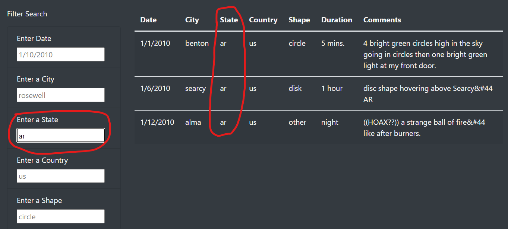

# UFOs 

## Overview of Project: 
In this project we are creating a web page with filters for the data file that we have about the UFO sightings.
The data file contains elements such as date of sighting, city, state, country, the shape of UFO, duration, and comments.

The data file is quite big, so we need to have filters in place to be able to navigate through the data.

Dana has only created one filter and that is the date filter. We will also add filters on city, state, country, and the shape.

## Results: 
In addition to Dana's date filter on the data, we have added filters on other filterable elements of the data. City, State, Country, and Shape filters have been added to web page:

We also removed the filter button as our JS code will be listening for a "change" event rather than Dana's buttonClick event. This helps the page visitor gets one step closer to filtered data.

Here are the pictures to show the before and after of the filter section:

### Dana's filter section (before):

### Our filter section (after):

In our new filter section, all that the visitor needs to do is to enter the parameters in the fields and press tab to go to the next input field or press enter and the new filtered data will be populated.

#### Example of Filtered Data on State 'ar':

#### Example of Filtered Data on State 'ar' and date '1/6/2010':

## Summary: 
This new filtering tool, though improved, is still far from ideal. In this section we will name a few drawbacks of this tool and a few recommendations for future developments:

__Drawback__

- Once we filter the data, if we want to do a new filter, we need to refresh the page, as there is no clear filter button.
- Also, the input fields do not ignore the Casing of the text eneterd and if I enter 'Fresno' as city, it will not return the same data as it would when 'fresno' is entered as city.
Both of these drawbacks are easily correctable in the future developments of the code.

__Recommendations__

1) We can add a clear filter button to have full data table back and be able to do a fresh filter.
2) In order to minimize input errors, we can have a drop-down calendar instead of a text field for date search.
3) We can also give the option of using multiple entries per each field. for example, if a visitor wants to search for UFO sightings of both California and Texas. 

Many other recommendations come to mind, and we will need to discuss all those with Dana.

